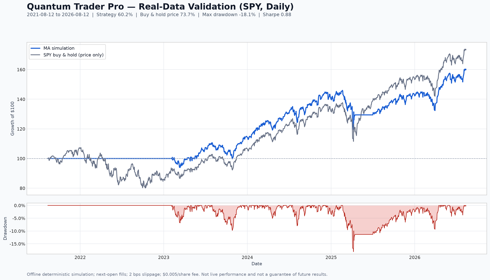
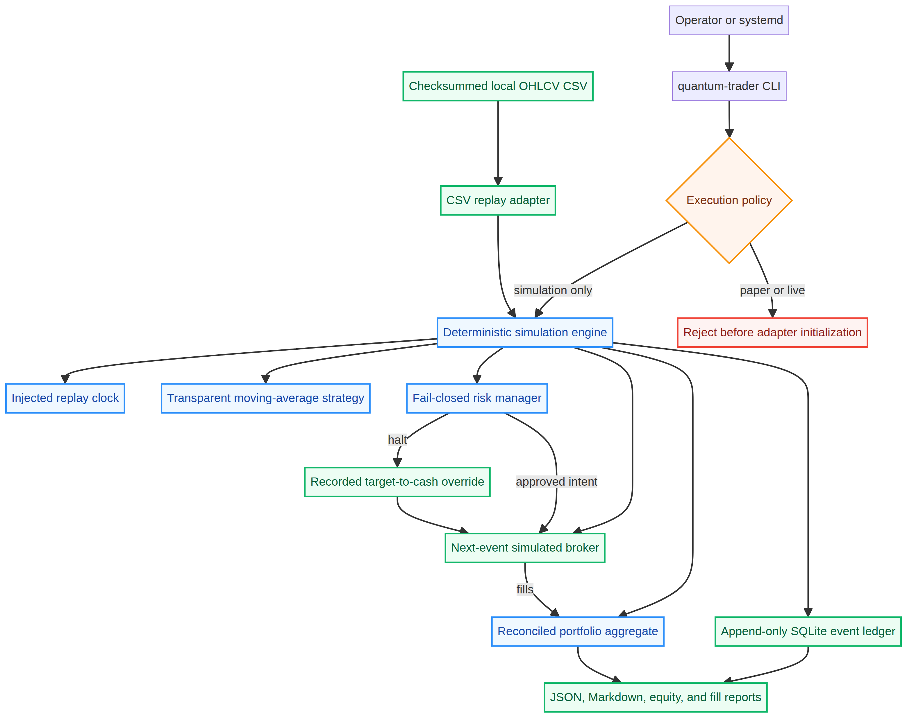

<div align="center">

# Quantum Trader Pro

**A deterministic, simulation-only trading research engine with fail-closed risk controls, next-event execution modeling, and a cryptographically traceable event ledger.**

*Originally built as a first algorithmic-trading project, then reconstructed into a safe, reproducible portfolio-grade engineering system.*

[](.github/workflows/quality.yml)
[](tests)
[](tests)
[](docs/ENGINEERING_GRADE.md)
[](pyproject.toml)
[](SAFETY.md)
[](LICENSE)

</div>

---

## What It Does

Quantum Trader Pro replays a local OHLCV dataset through an explicit sequence of market-data validation, deterministic signal generation, target-position construction, fail-closed risk review, next-event simulated execution, reconciled portfolio accounting, and append-only event recording. Every generated report is derived from the same ordered observations and declares its fees, slippage, conservative execution buffer, benchmark availability, end-of-test policy, and fill methodology.

The repository intentionally contains **no paper- or live-broker adapter**. The command-line interface accepts only `simulation`; any paper or live mode is rejected before an adapter can be initialized. This is a portfolio and research-engineering project, not an autonomous capital-deployment system.

| Capability | Implementation |
|---|---|
| Market data | Strict local CSV replay with timezone normalization, OHLC validation, optional all-or-none `adjusted_close`, gap checks, ordering checks, and SHA-256 provenance |
| Strategy | Transparent moving-average target-allocation model with deterministic warm-up behavior |
| Risk | Fee-, slippage-, and gap-aware buy sizing plus post-fill exposure, reserve, order-notional, drawdown, realized-loss, and duplicate-intent controls |
| Emergency behavior | New exposure is blocked while a recorded target-to-cash override remains permitted |
| Execution | Orders fill only at the next eligible event open with declared fees and slippage |
| Accounting | Cash, holdings, average cost, realized P&L, unrealized P&L, fees, and equity reconcile on every event |
| Auditability | Ordered SQLite event ledger with canonical JSON payload hashes |
| Reporting | JSON, Markdown, equity, fill, and flat-to-flat trade CSVs with total-return-proxy availability, price diagnostics, exposure, turnover, drawdown, expectancy, and risk state |
| Process safety | Single-instance lock and explicit output-overwrite protection |

---

## Evaluation Card

> **v0.1.0 baseline note:** This retained result is an earlier transparent engineering validation, not a tuned strategy result, authenticated live performance, or a guarantee of future returns. Its benchmark is an **unadjusted price return** with dividends excluded. The A+ branch now refuses to treat that price-only series as a headline total-return benchmark and is replacing this card through the frozen [`evaluation/protocol_v1.json`](evaluation/protocol_v1.json) and its readable [`research protocol`](docs/RESEARCH_PROTOCOL.md).

The clean engine was evaluated on 1,255 daily SPY OHLCV observations spanning August 12, 2021 through August 12, 2026. The observations were obtained through the Yahoo Finance chart-data interface; Yahoo’s public historical page exposes Open, High, Low, Close, Adjusted Close, and Volume and explains its price-adjustment conventions.[1] Nasdaq independently identifies SPY as the State Street SPDR S&P 500 ETF Trust and provides a historical-data interface.[2]

| Evaluation field | Result |
|---|---:|
| Input observations | 1,255 daily bars |
| Strategy | 50/200-day moving-average target allocation |
| Initial simulated equity | $100,000 |
| Strategy return | 60.21% |
| SPY buy-and-hold price return | 73.66% |
| Excess versus price benchmark | -13.45 percentage points |
| Annualized strategy return | 9.89% |
| Maximum drawdown | -18.07% |
| Sharpe ratio, 0% risk-free rate | 0.88 |
| Simulated fills | 58 |
| Execution costs | 2 bps slippage plus $0.005/share |



The same input and configuration were executed independently twice. The generated JSON report, Markdown report, equity curve, fills, and SQLite ledger were **byte-for-byte identical**. The full machine-readable result is retained in [`docs/assets/spy_validation_report.json`](docs/assets/spy_validation_report.json), the readable run report is available at [`docs/assets/spy_validation_report.md`](docs/assets/spy_validation_report.md), and [`docs/METHODOLOGY.md`](docs/METHODOLOGY.md) documents the formulas, data boundary, bias limitations, and reproducibility hashes.

---

## Architecture



The architecture uses ports and adapters so market data, brokerage, and persistence remain outside the domain model. The strategy never calls a broker directly. The engine records the market event, reconciles existing fills, marks the portfolio, evaluates circuit breakers, generates a signal, translates it into an intent, applies risk policy, and only then hands an approved order to the simulated broker.

The current implementation is deliberately finite rather than an always-on market daemon. A system service can schedule or launch a simulation job, but there is no credential path, production endpoint, or live order route. See [`ARCHITECTURE.md`](ARCHITECTURE.md), [`SAFETY.md`](SAFETY.md), and [`THREAT_MODEL.md`](THREAT_MODEL.md) for the current design boundary. The in-progress A+ expansion is governed by [`docs/LIVE_READINESS.md`](docs/LIVE_READINESS.md) and [`docs/BROKER_THREAT_MODEL.md`](docs/BROKER_THREAT_MODEL.md); [`docs/DEPLOYMENT.md`](docs/DEPLOYMENT.md) covers the hardened cloud-computer installation.

---

## One-Click Demo

Quantum Trader Pro requires **Python 3.11 or newer**, but the offline demo requires no package installation, data download, account, API key, or broker connection. Download and extract the latest [release zip](https://github.com/5chm33/quantum-trader-pro/releases/latest), then use the launcher for your operating system:

| Operating system | One-click action |
|---|---|
| Windows | Double-click **`launch_demo.cmd`** |
| macOS or Linux | Double-click **`launch_demo.sh`**, or run `./launch_demo.sh` |
| Any platform with Python | Run `python launch_demo.py` |

The launcher processes the bundled, clearly labeled synthetic fixture and creates a unique folder under `quantum-trader-demo-runs/` containing the SQLite ledger, JSON and Markdown reports, equity curve, fills, and `round_trip_trades.csv`. It discloses whether adjusted-close benchmark data is unavailable, cancels pending orders at the final bar, and marks any remaining position to the final close. It can only invoke `simulation`; it contains no paper/live endpoint or credential path.

If Python is not installed, use the official installer from [python.org](https://www.python.org/downloads/), enable the Windows “Add Python to PATH” option, and run the launcher again.

## Developer Installation

Development tooling is isolated in the optional `dev` dependency group.

```bash
git clone https://github.com/5chm33/quantum-trader-pro.git
cd quantum-trader-pro
python3 -m venv .venv
source .venv/bin/activate
python -m pip install --upgrade pip
python -m pip install -e '.[dev]'
quantum-trader preflight
quantum-trader demo
```

For research, provide a real local CSV with the required columns shown below. Rows must be strictly increasing, prices must form a valid OHLC bar, volume must be non-negative, and timestamps must be ISO-8601 values. Naive timestamps are interpreted as UTC by default.

```csv
datetime,open,high,low,close,volume
2024-01-02T14:30:00+00:00,100.00,101.25,99.75,100.80,1250000
```

The CLI refuses to overwrite an existing event ledger or report set unless `--overwrite` is supplied explicitly.

---

## Output Artifacts

| Artifact | Purpose |
|---|---|
| `events.sqlite3` | Ordered decision-to-fill ledger with canonical payload hashes |
| `simulation_report.json` | Machine-readable configuration, methodology, metrics, and final state |
| `simulation_report.md` | Human-readable evaluation card and methodology disclosure |
| `equity_curve.csv` | Timestamped reconciled cash, market value, equity, P&L, and fees |
| `fills.csv` | Simulated fill IDs, side, quantity, price, fees, slippage, and notional |

The report embeds the input checksum through the source identifier and adds a metrics checksum. Repeating the same code, source bytes, and configuration produces the same core artifacts.

---

## Quality Gate

The repository quality gate is intentionally stricter than the historical prototype. It requires formatting and lint checks, strict static typing, unit/integration/smoke tests, at least 90% coverage, a source security scan, and an installation/preflight smoke test.

```bash
ruff format --check src tests
ruff check src tests
mypy src
pytest --cov=quantum_trader --cov-report=term-missing
bandit -q -r src
python -m build
```

The current validated baseline is **42 passing tests**, **92.14% statement/branch coverage**, no strict-type errors, no Ruff findings, and no Bandit findings.

---

## Repository Map

| Path | Responsibility |
|---|---|
| `src/quantum_trader/domain/` | Immutable models, strategy, risk policy, portfolio accounting, and clocks |
| `src/quantum_trader/application/` | Orchestration, lifecycle lock, metrics, and report generation |
| `src/quantum_trader/ports/` | Broker, market-data, and event-store interfaces |
| `src/quantum_trader/adapters/` | Strict CSV replay, simulated brokerage, and SQLite persistence |
| `tests/unit/` | Domain invariants and defensive-path coverage |
| `tests/integration/` | Deterministic end-to-end replay and ledger verification |
| `tests/smoke/` | Installed CLI, artifact, and prohibited-mode checks |
| `docs/` | Architecture, methodology, legacy audit, deployment, and visual evidence |
| `deployment/` | Hardened simulation-only systemd templates |

---

## Project History and Evidence Boundary

The final evidence-weighted portfolio assessment is **A- (92.45/100)**; the complete rubric and separate assessment of the original project’s ambition are documented in [`docs/ENGINEERING_GRADE.md`](docs/ENGINEERING_GRADE.md).

The original archive contained 381 Python and launcher files, 35.61 GB of historical logs, multiple databases, model artifacts, backup generations, Windows scheduled-task launchers, Alpaca integration, and Kalshi components. It also contained hard-coded credential findings, conflicting dependency manifests, syntax and interface failures, silent synthetic fallbacks, and direct live-order call sites. The original files remain preserved outside this repository and were never executed during the audit.

The archive documents substantial engineering effort and long-running operation, but it does **not independently prove a year of profitable broker execution**. The only outcome database contains 440 `AI_BUY` rows with no exit price or recorded P&L, the automation performance tables are empty, and the available records lack broker fill IDs, fees, account identifiers, and cash-flow reconciliation. This repository therefore makes no verified-live-profitability claim. See [`docs/LEGACY_AUDIT.md`](docs/LEGACY_AUDIT.md) for the full evidence boundary.

---

## Known Limitations

Quantum Trader Pro currently models a single long-only asset per run, uses a weekday/session helper rather than a complete exchange-holiday calendar, and does not apply dividends or corporate actions. The included strategy has not undergone isolated parameter selection, walk-forward validation, or multi-regime out-of-sample testing. The simulated broker does not model partial fills, queue position, market impact, halts, borrow, margin, options, or taxes.

These limitations are intentional and documented. Adding a paper adapter would require broker-specific authentication, rate-limit and outage handling, account reconciliation, idempotent client order IDs, and a separate integration-test environment. Live execution is outside the current scope.

---

## Contributing

See [`CONTRIBUTING.md`](CONTRIBUTING.md). Changes must preserve the simulation-only boundary, maintain deterministic replay, add tests for new behavior, and pass the complete quality gate before review.

---

## License

MIT — see [`LICENSE`](LICENSE).

## References

[1]: https://finance.yahoo.com/quote/SPY/history/ "Yahoo Finance — SPY Historical Data"
[2]: https://www.nasdaq.com/market-activity/etf/spy/historical "Nasdaq — State Street SPDR S&P 500 ETF Trust (SPY) Historical"
