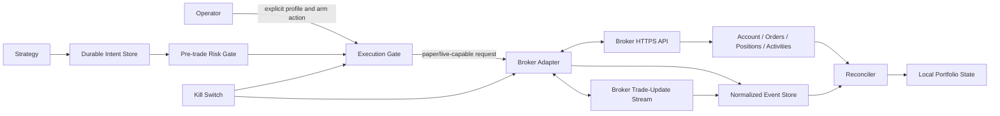

# Broker Integration Threat Model

## Scope

This model covers optional paper and future live brokerage adapters. The current v0.1.0 simulation baseline has no brokerage dependency. The target design keeps simulation as the default and treats every network response, stream event, local file, clock reading, and operator command as potentially stale, duplicated, delayed, malformed, or unauthorized.

## Protected Assets

| Asset | Consequence of compromise |
|---|---|
| Brokerage credentials | Unauthorized account access or order submission |
| Operator arming authority | Execution in an unintended profile or account |
| Cash, buying power, and positions | Financial loss or false risk decisions |
| Order identity and state | Duplicate, conflicting, or orphaned orders |
| Fill and activity evidence | Incorrect P&L, position, tax, or audit records |
| Strategy/configuration fingerprint | Running unreviewed behavior under an old acceptance decision |
| Market data and clock state | Decisions on stale prices or closed sessions |
| Kill-switch channel | Inability to halt or malicious forced liquidation |
| Logs and reports | Secret disclosure or misleading operational evidence |

## Trust Boundaries

The adapter is not an authority on portfolio state by itself. The reconciler compares broker snapshots and activities with normalized local evidence. The engine cannot arm while a divergence remains unexplained.

## Threat and Failure Analysis

| ID | Scenario | Failure mode | Required mitigation | Residual risk |
|---|---|---|---|---|
| BT-01 | Credential disclosure | Unauthorized API activity | Credentials outside repository; least-privilege paper keys; redaction; file-mode checks; rotation guide | Broker/account compromise outside application |
| BT-02 | Wrong environment | Live order sent with intended paper test | Explicit enum; endpoint allowlist; key/account fingerprint binding; live unavailable in one-click launcher | Operator config error during separately authorized live setup |
| BT-03 | Ambiguous submit timeout | Duplicate order on retry | Persist intent and client ID first; query by client ID; no blind retry | Broker may delay visibility; system remains halted until resolved |
| BT-04 | Duplicate stream event | Fill/accounting applied twice | Unique execution identity; transactional insert; idempotent projection | Missing stable execution ID requires conservative composite identity |
| BT-05 | Lost or reordered stream event | Local state diverges | REST reconciliation on startup/reconnect/gap plus paginated activities | Temporary stale display before reconciliation completes |
| BT-06 | Partial fill | Position and remaining quantity miscomputed | Explicit cumulative and incremental fill handling; invariant checks | Broker corrections may arrive later |
| BT-07 | Cancel race | Fill occurs while cancel is pending | Continue processing updates; verify terminal state; reconcile before replacement | Market execution during cancel latency |
| BT-08 | Process crash after submit | Unknown external order ownership | Durable submission journal; deterministic client ID; startup reconciliation before arming | Filesystem loss requires broker-side reconstruction |
| BT-09 | Stale or manipulated market data | Mispriced order | Maximum age; source identity; crossed/outlier checks; broker snapshot comparison | Legitimate extreme markets may trigger a halt |
| BT-10 | Closed or exceptional session | Order placed outside policy | Broker clock/calendar; explicit extended-hours policy; fail closed | Broker calendar error or sudden market halt |
| BT-11 | Order loop | Rapid repeated submissions | Duplicate fingerprint; rolling rate limits; total open-order cap; circuit breaker | Multiple independent deployments without shared lock |
| BT-12 | Foreign account activity | Bot offsets manual/other-strategy order | Client-ID namespace ownership; halt on unexplained orders/positions | Deliberate multi-strategy use requires a coordination policy |
| BT-13 | Excess leverage or buying-power drift | Broker accepts more risk than local policy | Use minimum of local and broker limits; cash reserve; margin disabled by default | Broker mark and local mark may differ |
| BT-14 | Malicious input CSV/config | Path traversal, resource exhaustion, unsafe values | Strict schemas; roots; size limits; no dynamic deserialization | Authorized operator can still choose poor parameters |
| BT-15 | Compromised dependency | Secret theft or order manipulation | Minimal optional dependencies; hashes/lock; Dependabot; CI scans; isolated service user | Supply-chain zero day |
| BT-16 | Kill-switch misuse | Accidental liquidation | Separate pause/cancel/flatten actions; explicit confirmation; bounded symbols; event evidence | Emergency exit can realize loss |
| BT-17 | Kill-switch failure | Exposure persists | Broker verification; unresolved exposure alarm; out-of-band broker UI instructions | Network/broker outage may prevent action |
| BT-18 | Clock rollback | Invalid expiry or replay | UTC monotonic durations; broker timestamps; reject backwards wall-clock sequence | Host compromise |
| BT-19 | Disk full/corruption | Intent not persisted or evidence lost | Pre-submit durable write; disk preflight; SQLite integrity; fail closed | Catastrophic disk loss |
| BT-20 | Misleading performance claim | Unsafe trust in strategy | Strict simulation/paper/live labels; benchmark and cost disclosure; broker-evidence boundary | Readers may ignore documentation |

## Security Architecture Decisions

The base package remains dependency-free and offline. A normal clone and one-click simulation cannot request credentials or reach a broker. The strict paper credential loader accepts only allowlisted, service-user-owned, non-symlink files with mode `0600` or stricter in an absolute out-of-band directory; no public command invokes it. Broker clients can be constructed only after configuration validation, secret acquisition, account fingerprint verification, and an explicit paper gate.

The adapter receives immutable approved orders rather than strategy objects. It cannot generate signals or bypass risk. Each network method returns a normalized value object and raw payload hash, while secret-bearing headers and credential fields are excluded before logging. A separate mode-`0600` operator database starts paused. Resume and cancel require distinct, expiring, one-use HMAC approvals; cancel touches only deterministic strategy-owned orders, verifies terminal and residual state, reconciles, and remains paused. Flattening and live execution remain unavailable.

The event store uses transactions for submission journals and deduplication. External IDs are unique where the broker guarantees uniqueness; otherwise a documented composite identity is used. Projections can be rebuilt from normalized events and compared with broker state.

## Operational Response

| Severity | Example | Automatic behavior | Operator action |
|---|---|---|---|
| Critical | Wrong account, unexplained position, duplicate external order | Disarm, reject new exposure, preserve evidence | Review broker UI; choose pause/cancel/flatten explicitly |
| High | Stream gap, ambiguous submission, cancel failure | Disarm and reconcile | Resolve mismatch before re-arming |
| Medium | Stale data, market closed, temporary rate limit | Reject new exposure and retry bounded reads | Monitor or wait for recovery |
| Low | Optional report failure | Preserve trading evidence; keep disarmed if auditability is affected | Repair reporting path |

No failure automatically promotes an operating mode, substitutes a price or signal, or assumes an external action succeeded.

## Acceptance Evidence

A release candidate must include transition-table coverage, duplicate-event property tests, timeout/restart tests, stale-data and calendar tests, permission/symlink/secret-redaction tests, one-use approval and replay tests, pause/resume/cancel fixtures, broker-contract fixtures, SQLite integrity checks, package and launcher smoke tests, and an authenticated paper acceptance record tied to an exact commit and configuration fingerprint. Position flattening requires a separate partial-fill and residual-exposure validation campaign. Live execution remains unavailable and is not implied by passing the paper gate.
