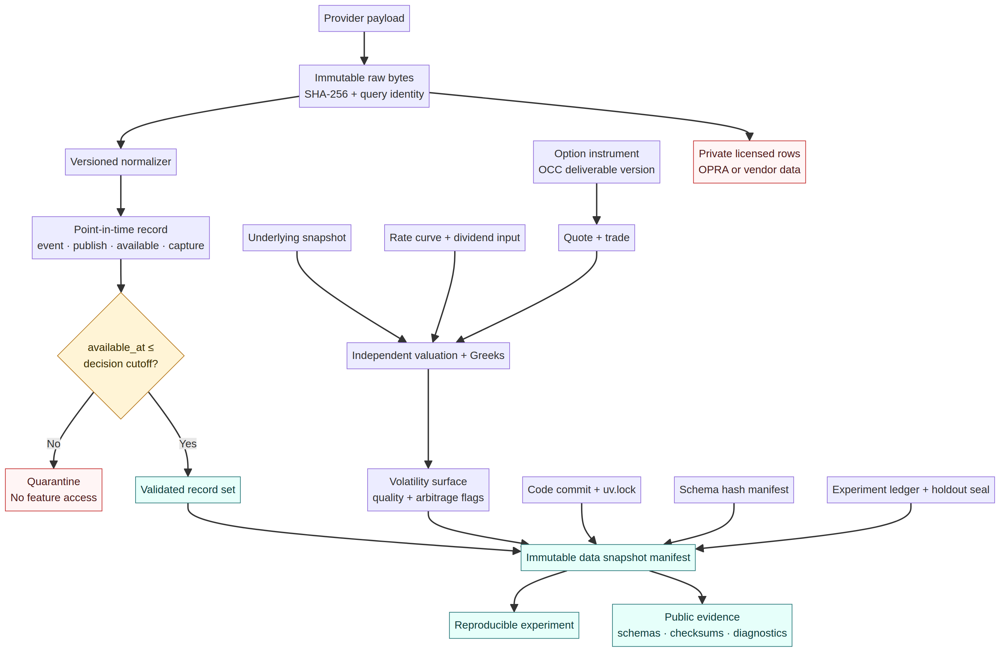

# Point-in-Time Equity, Volatility, and Options Data Contracts

Quantum Trader Pro treats data correctness as a **causal contract**, not a file-format preference. A record may enter a feature, signal, selection rule, benchmark, valuation, or execution model only when its `available_at` timestamp is no later than the strategy decision cutoff. Event dates, fiscal period ends, expiration dates, and provider retrieval dates are never accepted as substitutes for availability time.

> **Point-in-time record:** an append-only observation whose business event, publication, first usable availability, capture time, revision lineage, source query, license, raw payload, normalization version, and normalized identity are all independently retained.

This contract is provider-neutral. It supports an open equity-first pipeline, licensed local OPRA research, or a managed options platform without allowing a provider-specific convenience field to weaken timing, identity, or audit requirements. The approach comparison remains in [`RESEARCH_APPROACHES.md`](RESEARCH_APPROACHES.md).

## Non-Negotiable Temporal Semantics

Every record uses four distinct clocks. These clocks are validated across records even when JSON Schema cannot express their ordering directly.

| Field | Meaning | Required ordering |
|---|---|---|
| `event_at` | When the underlying economic or market event occurred | May precede publication by days, months, or years |
| `published_at` | When the source says it published the record, if known | Must not be later than `available_at` |
| `available_at` | Earliest defensible time the research process could have used the value | Must not be later than the decision cutoff |
| `captured_at` | When the pipeline acquired and checksummed the source payload | Must not precede `available_at` |

A filing for a quarter ending March 31 is therefore unavailable on March 31 unless it was actually disseminated that day. SEC submission and XBRL APIs are updated as filings are disseminated, so filing acceptance and accession identity—not report-period end—govern feature availability.[1] Revised macroeconomic values require FRED/ALFRED vintage dates rather than the latest value copied backward through history.[2]

Corrections are append-only. A corrected record increments `record_version` or `revision`, sets `is_correction`, and points to `supersedes_record_id`. In-place replacement is prohibited because it would make previous experiments unreproducible.

## Shared Envelope

The shared [`common_v1.schema.json`](../research/schemas/common_v1.schema.json) definitions require immutable record identity, exact decimal strings, UTC timestamps, security identity, provenance, and SHA-256 digests. Floating-point JSON numbers are not accepted for economic values.

| Envelope | Required evidence |
|---|---|
| Identity | Stable `record_id`, version, revision, correction flag, and optional superseded record |
| Availability | Event, optional publication, first usable availability, and capture timestamps |
| Provenance | Provider, dataset, provider schema version, source URI, license class, redistribution permission, raw/query hashes, normalization version, and source sequence when supplied |
| Security | Stable instrument ID, asset class, currency, symbol/exchange aliases, and optional SEC CIK |
| Numeric representation | Canonical decimal strings; non-finite and binary floating-point values are prohibited |

The data-snapshot manifest binds each experiment to a decision cutoff, exact code commit, environment lock, schema manifest, source queries, raw and normalized hashes, record counts, date ranges, license classes, and holdout boundaries.

## Contract Catalog

The repository publishes **18 versioned JSON Schemas** and a deterministic hash manifest. Raw licensed option data is never committed.

| Contract | Research responsibility |
|---|---|
| `common_v1` | Shared identity, provenance, timing, checksum, decimal, and security types |
| `equity_bar_v1` | Raw OHLCV, optional separately identified adjusted values, session, conditions, and finality |
| `universe_membership_v1` | Survivorship-safe additions, removals, suspensions, delistings, and effective dates |
| `fundamental_fact_v1` | SEC-style accession, form, acceptance time, report period, taxonomy, units, dimensions, and amendments |
| `earnings_estimate_snapshot_v1` | Frozen pre-announcement consensus, dispersion, contributor count, and cutoff |
| `earnings_event_v1` | Actual result, announcement session, first executable time, and linked estimate snapshot |
| `corporate_action_v1` | Dividends, splits, distributions, listings, delistings, mergers, symbol changes, and option adjustments |
| `market_session_v1` | Holidays, early closes, emergency closures, instrument halts, and resumptions |
| `borrow_snapshot_v1` | Availability, fee, rebate, locate status, quantity, and expiry |
| `rate_curve_v1` | Revision-aware curve nodes, currency, day count, compounding, interpolation, and vintage |
| `dividend_input_v1` | Announced or forecast discrete cash flows and optional continuous yield |
| `option_instrument_v1` | Stable OCC-style identity, right, strike, expiry, multiplier, exercise, settlement, and deliverables |
| `option_quote_v1` | NBBO or venue top-of-book, sizes, conditions, market state, sequence, and underlying linkage |
| `option_trade_v1` | Price, size, venue, sale conditions, sequence, quote linkage, and underlying linkage |
| `option_greeks_v1` | Retained valuation inputs, model identity, IV, Greeks, convergence, residual, and arbitrage flags |
| `volatility_surface_v1` | Observed or fitted IV nodes, bid/ask IV, model version, input records, residuals, and quality flags |
| `volatility_term_structure_v1` | Spot volatility, futures, forward variance, realized volatility, maturities, and methodology version |
| `data_snapshot_manifest_v1` | Complete experiment-level source, schema, hash, date, license, code, environment, and holdout identity |

The executable [`verify-data-contracts.py`](../scripts/verify-data-contracts.py) rejects missing contracts, unsupported or unresolved references, duplicate identities, noncanonical repository IDs, unknown-field-tolerant top levels, missing point-in-time envelopes, and stale manifest hashes.

## Equity, Fundamental, and Event Rules

Raw equity prices and adjustment factors remain distinct. A provider's adjusted close may be retained, but total-return factors must be identified independently and may never replace execution prices. Dividends, splits, listings, suspensions, and delistings are explicit events. NYSE identifies more than 60 corporate-action types, including cash and stock dividends, distributions, splits, new listings, suspensions, and delistings; the contract therefore does not reduce corporate actions to a single split factor.[3]

Universe membership is effective-dated and includes removed securities. A cross-sectional test cannot construct a historical universe from today's surviving tickers. Membership decisions retain the exact selection-rule version and point-in-time liquidity and capitalization fields used by the rule.

Fundamental facts retain the accession number, accepted timestamp, report period, taxonomy, unit, dimensions, and amendment lineage. SEC company facts are suitable raw inputs, but the research process must reconstruct what was available at the decision cutoff rather than use a current company-facts response as if it were a historical snapshot.[1]

Earnings consensus and realized announcements are separate contracts. The consensus snapshot has its own availability time and cutoff; the event links to that exact record. The strategy's first executable timestamp is after the announcement according to its pre-market, regular-session, post-market, or non-trading-day classification. Same-bar or pre-announcement execution is prohibited.

## Options Identity and Lifecycle

OPRA disseminates consolidated option last-sale and quote information from participating exchanges, and quote messages represent most option message traffic.[4] Options research therefore requires both quote and trade records; a daily midpoint alone cannot establish executable liquidity or fill probability.

A standard equity option normally represents 100 shares, uses American-style exercise, and physically delivers the underlying after exercise, but corporate actions can change the deliverable.[5] Equity and ETF options physically deliver, while index options can settle in cash, creating materially different expiration and gap exposure.[6] The instrument contract consequently retains multiplier, exercise style, settlement type and timing, last-trade and expiration timestamps, deliverable version, each deliverable component, and OCC memo lineage.

American-style assignment can occur before expiration. Dividend timing, deep in-the-money status, contrary exercise decisions, and post-market underlying moves can change the result, so lifecycle simulation may not mechanically assign every in-the-money contract only at the closing price.[7]

### Quote and Trade Requirements

An admissible option quote retains bid and ask independently, associated sizes, quote scope, venue or consolidated identity, condition codes, source sequence, market state, and the exact underlying snapshot. One-sided, locked, crossed, halted, closed, stale, and unknown markets remain explicit states. They are not silently converted into a midpoint.

A trade retains execution price, size, venue, conditions, sequence, exchange trade ID when supplied, prior quote link, and underlying snapshot. The cost and fill model later uses the quote immediately preceding the decision and never a quote published afterward.

### Greeks and Volatility Surfaces

Vendor Greeks are observations, not ground truth. Provider-reported and independently calculated values remain distinguishable. Every valuation binds the option quote, underlying, rate curve, dividend input, optional borrow input, model and version, calculation time, price inputs, convergence state, residual, and arbitrage diagnostics.

A volatility surface retains the observed contracts and quotes behind each node. Fits must disclose model identity, coordinate system, residuals, mixed-capture timing, sparse expiries, wide or crossed quotes, and calendar or butterfly violations. A fitted surface without retained input identities is inadmissible.

## Rates, Dividends, and Revisions

Rate inputs retain currency, curve type, collateral basis, day-count convention, compounding, interpolation, source series, and vintage. FRED explicitly exposes dates when values were revised or released; research using macro or rate series must use that vintage information.[2] Treasury Fiscal Data responses include record dates, metadata, pagination, and source endpoints, which are retained with query and raw hashes.[8]

Dividend inputs distinguish announced cash flows, provider forecasts, historical carry-forward estimates, implied yields, and explicit zero-dividend assumptions. Forecast dividends may support a scenario but cannot be relabeled as known cash flows.

## Licensing and Public Evidence

OPRA defines current quote and last-sale information as licensed market data and restricts redistribution according to subscriber and vendor agreements.[4] The public repository may therefore contain schemas, provider documentation links, code, synthetic correctness fixtures, manifests, record counts, checksums, aggregate diagnostics, and reproducible summaries. It may not contain raw licensed OPRA or vendor rows unless the license explicitly permits redistribution.

| License class | Public repository rule |
|---|---|
| `open` | Raw or normalized data may be published only when the source license permits it and attribution is retained |
| `licensed_nonredistributable` | Store privately; publish schemas, checksums, counts, summaries, and reproducible retrieval instructions only |
| `private` | Store privately; publish no raw values or identifiers that expose the account or subscriber |
| `synthetic` | May be public when clearly labeled and never used as performance evidence |

## Cross-Record Acceptance Gates

Schema validation is necessary but insufficient. An experiment snapshot is rejected unless all of the following conditions hold.

| Gate | Fail-closed rule |
|---|---|
| Causality | Every feature input has `available_at <= decision_cutoff_at` |
| Capture order | Every record has `available_at <= captured_at` |
| Publication order | Non-null `published_at <= available_at` |
| Revision lineage | Corrections append and reference the superseded identity |
| Identity | Instrument, accession, OCC symbol, execution, and source IDs are unique within their declared namespace |
| Price logic | Equity OHLC is internally consistent; option quote and trade values are nonnegative; crossed or one-sided states remain flagged |
| Corporate actions | Adjustment factors reconcile to explicit action records; option adjustments retain deliverable versions and memo evidence |
| Universe | Removed, suspended, and delisted securities remain in historical membership data |
| Options | Every quote/trade/Greek references an instrument version effective at the event time and an underlying snapshot available by the decision cutoff |
| Surface quality | No-arbitrage, staleness, spread, sparsity, and convergence flags are retained and promotion rules may exclude but never erase them |
| Snapshot integrity | Code, lockfile, schemas, queries, raw payloads, normalized files, counts, dates, and holdout boundaries match the manifest |
| License | Public artifacts comply with `license_class` and `redistribution_allowed` |

## Implementation Boundary

These schemas do not claim that a licensed options dataset has been acquired or that an options strategy has been validated. They define the minimum evidence any later provider adapter must produce. The public CLI remains simulation-only, the existing v1 holdout remains sealed, authenticated paper activation remains blocked, and live execution remains unavailable.

## References

[1]: https://www.sec.gov/search-filings/edgar-application-programming-interfaces "SEC — EDGAR Application Programming Interfaces"
[2]: https://fred.stlouisfed.org/docs/api/fred/ "Federal Reserve Bank of St. Louis — FRED API"
[3]: https://www.nyse.com/market-data/corporate-actions "NYSE — Corporate Actions"
[4]: https://www.opraplan.com/faqs "Options Price Reporting Authority — FAQs"
[5]: https://www.theocc.com/clearance-and-settlement/clearing/equity-options-product-specifications "OCC — Equity Options Product Specifications"
[6]: https://www.cboe.com/insights/posts/why-option-settlement-style-matters/ "Cboe — Why Option Settlement Style Matters"
[7]: https://www.optionseducation.org/optionsoverview/exercising-options "Options Industry Council — Exercising Options"
[8]: https://fiscaldata.treasury.gov/api-documentation/ "U.S. Treasury Fiscal Data — API Documentation"
