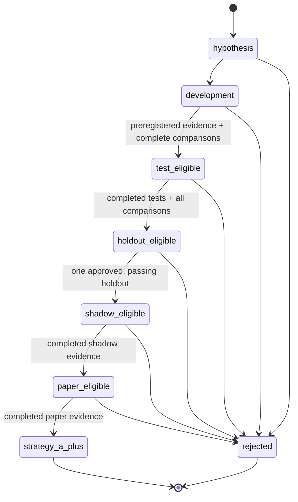

# Immutable Experiment Ledger

> **Purpose:** retain every preregistered research attempt, including failures and rejections, while preventing strategy promotion from outrunning its evidence.

The experiment ledger is the strategy campaign’s **durable evidence authority**. It is separate from the simulation event store, broker journal, and operator controls. It does not execute a trade, make a performance claim, or confer a strategy grade. Its role is to make the evidence needed for those claims complete, attributable, and difficult to rewrite after the fact.

## What It Records

| Object | Immutable identity | Minimum retained evidence | Why it matters |
|---|---|---|---|
| Campaign | Campaign ID plus frozen governance, catalog, data-contract, and baseline hashes | Baseline commit and policy hashes | Defines the campaign whose score is being discussed. |
| Candidate | Family, bounded index, specification hash, and code commit | Candidate ceiling and registration time | Prevents silent candidate proliferation after seeing outcomes. |
| Preregistration | Candidate, protocol, snapshot, partitions, benchmarks, costs, and budget hashes | One frozen protocol record | Binds a candidate to its declared evaluation plan. |
| Attempt | Candidate, comparison group, stage, partition, configuration, costs, and inference plan | Registered, started, then terminal state | Retains completed, failed, and aborted runs alike. |
| Artifact | Attempt, content hash, byte count, media type, role, and license class | At least one artifact for a completed attempt | Makes reported metrics traceable to retained output. |
| Comparison | Group plus terminal-attempt manifest hash | Every assigned attempt terminal | Blocks selection while a comparison is incomplete. |
| Holdout | Candidate, sealed boundary, provider query, approval, retrieved snapshot, and result hash | One seal, one approval, one opening, one result | Prevents repeated attempts against a supposedly untouched lockbox. |

## State Machine



The state machine is deliberately stricter than a backtest runner. A state transition is not accepted merely because a metric is attractive; it needs the matching stage, frozen prerequisites, terminal attempts, opened comparison barriers, and retained gate-evidence hash.

## Attempt Lifecycle

An attempt has four possible durable terminal outcomes:

| Status | Meaning | Selection treatment |
|---|---|---|
| `completed` | The preregistered computation produced retained outputs. | Eligible for its declared comparison. |
| `failed` | The run ended with a retained failure code and reason hash. | Retained; cannot be silently discarded. |
| `aborted` | An operator or control stopped the run with a retained reason hash. | Retained; cannot be silently discarded. |
| `registered` / `started` | Work is pending or in progress. | Blocks comparison and promotion. |

A comparison group opens only after **every assigned attempt is terminal**. Its terminal manifest includes each attempt’s identity, candidate, stage, configuration hash, status, and result hash where available. A failed candidate can therefore be rejected honestly; a failure cannot be made invisible by omitting it from a comparison.

## Holdout Protocol

The lockbox is a distinct stage rather than another test fold. The ledger enforces the following sequence:

1. A candidate first becomes `holdout_eligible` only after completed test-stage evidence and all candidate-assigned comparison groups are opened.
2. Exactly one candidate-bound holdout may be sealed. Sealing records a boundary hash and provider-query hash while declaring that holdout bytes have not been retrieved.
3. Opening requires an explicit, expiring, one-use approval bound to that holdout and campaign.
4. Opening records the actual retrieved snapshot identity and its immutable manifest hash.
5. A locked-holdout attempt must use that exact snapshot identity.
6. The holdout cannot complete until that attempt is completed.
7. Only a passing terminal holdout can unlock shadow eligibility.

This mechanism does not make data revision impossible or make an observed result economically meaningful by itself. It makes the identity, approval, one-time access, and result boundary inspectable.

## Integrity Model

The SQLite ledger uses full-sync persistence, a hardened mode-`0600` path, symlink and writable-parent rejection, a SQLite header check for preexisting files, and an append-only event chain. Every event has:

- A contiguous sequence number;
- A deterministic event ID;
- A canonical JSON payload hash;
- The previous event hash; and
- A computed event hash over all event identity and payload-hash fields.

The mutable projection tables also have a separately retained canonical digest. Reopening the ledger checks the SQLite quick check, schema version, event-chain continuity, event payloads and hashes, projection/event count correspondence, and the projection digest. Tests exercise malformed JSON, hash-chain tampering, projection tampering, missing projection commitments, sequence gaps, insecure paths, restart persistence, failed and aborted attempts, and one-time holdout controls.

> This is an integrity and governance control, not a substitute for independent data custody, signed attestations, versioned off-site backups, or economic validation.

## Promotion Is Not a Profit Claim

A completed attempt, passing test, or even a passing holdout is **not** a claim of profitability. The [strategy-grade policy](../research/governance/strategy_grade_policy_v1.json) still requires hard evidence across data integrity, method, inference, economics, portfolio risk, operational controls, shadow operation, and authenticated paper operation. The currently published moving-average result remains a failed preregistered campaign, and its existing holdout remains sealed.

## Local Validation

From a checked-out source tree with the committed lockfile:

```bash
uv sync --locked --all-extras
PYTHONPATH=src uv run pytest -q tests/unit/test_experiment_ledger.py
make check
```

The first command exercises the ledger’s direct adversarial tests. The second executes the repository-wide locked quality gate, including governance and data-contract verification. Neither command accesses a brokerage account, submits an order, or opens an existing holdout.
