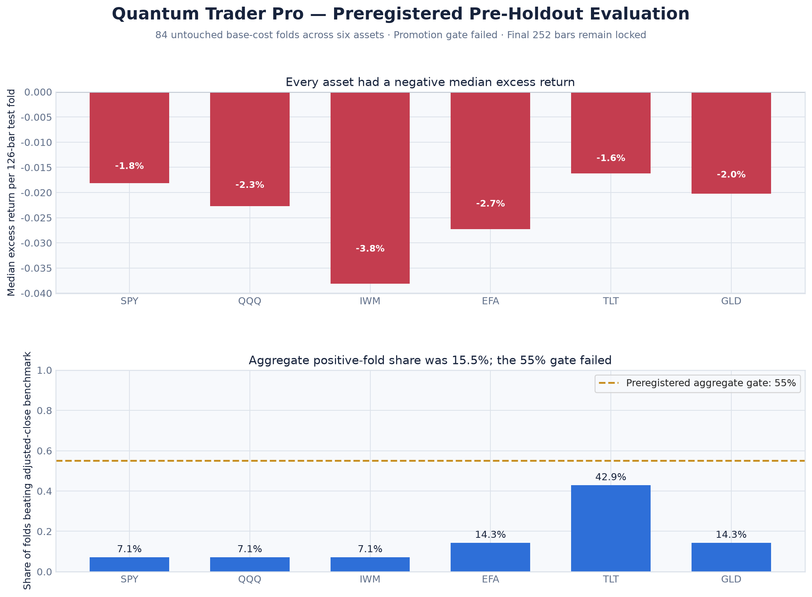
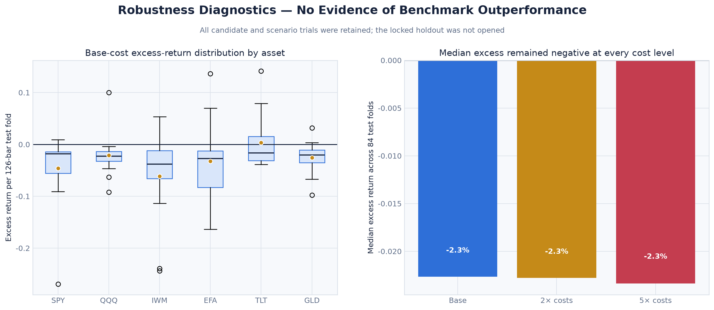

# v1 Pre-Holdout Walk-Forward Evidence

## Result

The preregistered `qtpro-walk-forward-v1` protocol **failed its pre-holdout promotion gate**. This is a retained negative result, not a profitability claim. The final 252 observations for each asset remain unopened.

| Measure | Observed | Frozen gate | Result |
|---|---:|---:|---|
| Assets with at least eight folds | 6 of 6 | 6 of 6 | Pass |
| Base-cost out-of-sample folds | 84 | At least 48 | Pass |
| Median base excess return | −2.27% | At least 0% | Fail |
| Folds beating adjusted-close benchmark | 15.48% | At least 55% | Fail |
| Median 2×-cost excess return | −2.28% | At least 0% | Fail |
| Median 5×-cost excess return | −2.34% | At least −5% | Pass |
| Worst test drawdown | −34.33% | No worse than −30% | Fail |
| Risk-halted cost scenarios | 6 | 0 | Fail |
| Pending final orders | 0 | 0 | Pass |
| Negative-cash runs | 0 | 0 | Pass |

## Scope

The engine retained **2,604 deterministic trials**: 2,016 validation candidates, 252 untouched out-of-sample cost scenarios, and 336 execution-buffer/start-offset robustness trials. The panel contains SPY, QQQ, IWM, EFA, TLT, and GLD daily observations from August 2015 through July 2026. Selection used validation results only; the selected specification was then replayed on the following untouched 126-bar block.

The complete run was executed twice independently. Every published core artifact was byte-identical across the two runs. `SHA256SUMS` records the retained digests.

## Artifact Index

| Artifact | Purpose |
|---|---|
| `protocol_snapshot.json` | Exact frozen protocol used for the run |
| `source_manifest.json` | Provider, date range, row counts, and data checksums; provider data are not redistributed |
| `trial_ledger.csv` | All 2,016 validation candidate trials, including failures and rejected candidates |
| `fold_selections.csv` | Deterministic candidate chosen from each validation block |
| `test_results.csv` | All 252 untouched base/2×/5× cost results |
| `robustness_results.csv` | All 336 execution-buffer and start-offset scenarios |
| `summary.json` | Machine-readable gates, observed values, and per-asset summaries |
| `report.md` | Concise human-readable result |
| `SHA256SUMS` | Integrity manifest for all evidence artifacts |

## Data and Holdout Boundary

The repository does not redistribute Yahoo market-data rows. `source_manifest.json` records the normalized CSV digests, and `scripts/fetch-evaluation-data.py` reconstructs the declared files from the public chart endpoint subject to the provider’s availability and terms. Market-data revisions can change a future digest; such a run is a new dataset version and must not silently replace this evidence.

The holdout was not opened because the pre-holdout gate failed. No `holdout_receipt.json`, `holdout_results.csv`, or `holdout_summary.json` exists. Preserving the lockbox allows a genuinely revised future strategy and a separately versioned protocol to be tested without pretending that this baseline earned final acceptance.

> **Evidence boundary:** This result does not authenticate the legacy project’s reported historical live performance, prove future profitability, or authorize live capital.
